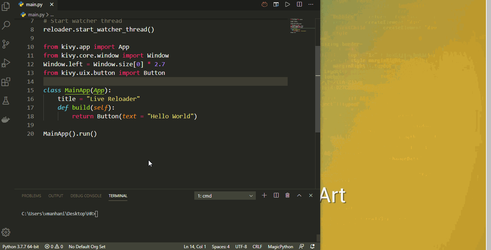

# kivy-live-reloader
Kivy live reloader, simple, effective and pythonic.

## Requirements
```
python >= 3.7

kivy == 1.11.1

watchdog == 0.10.2
```

## How To Run
```
python3 main.py

or

py main.py
```

## Sample

<p align="center">
  <a href="https://github.com/kivy-live-reloader">
    
  </a>
</p>